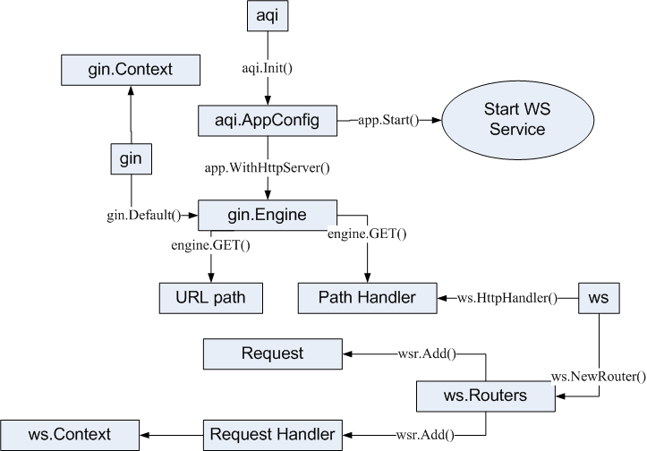

# Go Sample Projects
**1. Cobra**
   - go run main.go first first
   - go run main.go first second
   - to prepared dependancies:
     - go mod init
     - go mod tiny

# Go Sample Projects
**2. Aqi**
   - 
   - to prepared dependancies:
     - go mod init
     - go get -u github.com/wonli/aqi
   - go run main.go
   - to test this sample, use use [wscat](https://github.com/websockets/wscat)
      - wscat -c ws://localhost:2015/ws
        - {"action":"hi"}
